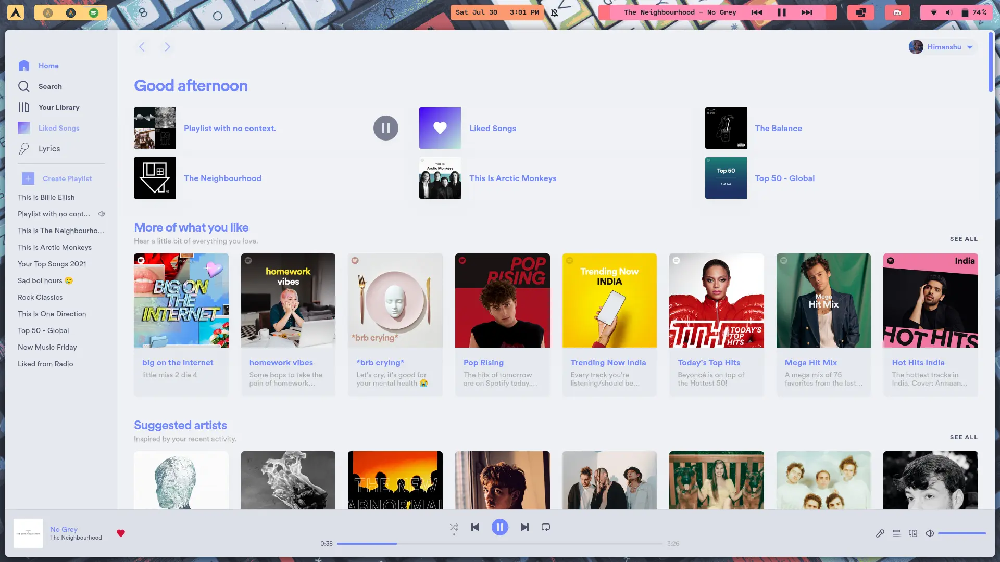
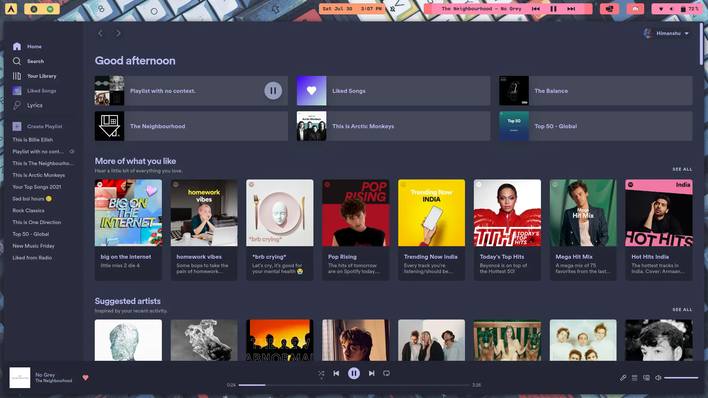
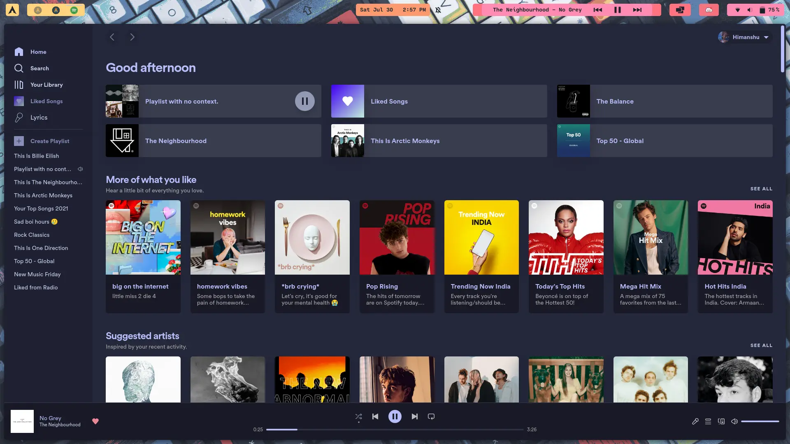
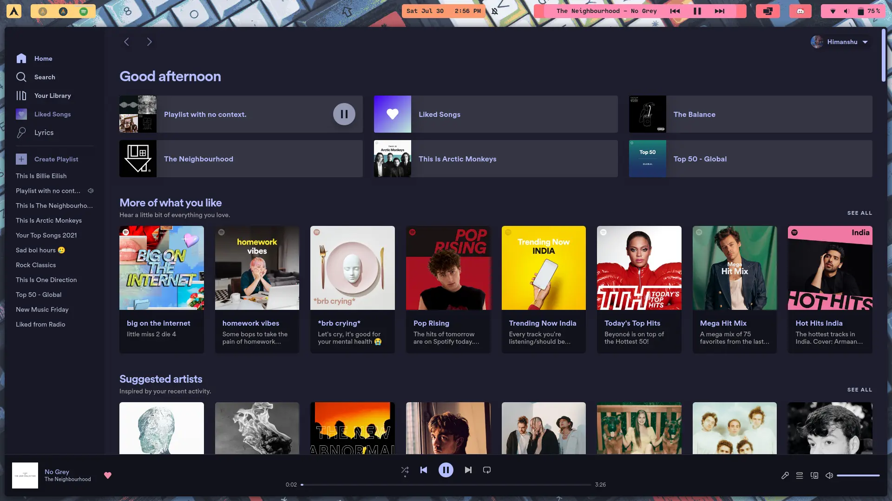

<h3 align="center">
	<br/>
	
	Catppuccin for <a href="https://github.com/spicetify/spicetify-cli">Spicetify</a>
	
</h3>

<p align="center">
    <a href="https://github.com/catppuccin/spicetify/stargazers"></a>
    <a href="https://github.com/catppuccin/spicetify/issues"></a>
    <a href="https://github.com/catppuccin/spicetify/contributors"></a>
</p>


## Previews

<details>
<summary>🌻 Latte</summary>

</details>
<details>
<summary>🪴 Frappé</summary>

</details>
<details>
<summary>🌺 Macchiato</summary>

</details>
<details>
<summary>🌿 Mocha</summary>

</details>

## Usage

1. Follow the installation instructions for [Spicetify](https://spicetify.app/docs/getting-started)
   * Note: The installation instructions for linux have you setting `/opt/spotify` and `/opt/spotify/Apps/*` permissions to `777`. This is not good practice and should be avoided. If you want, you can set the group ownership for these paths to one that your user is apart of (i.e. `users`), or you can create a new group and add it as a secondary group to your user. After that you can use the following command to give access to the group:
      ```
      GROUP=<group_name>
      sudo chgrp $GROUP /opt/spotify
      sudo chgrp -R $GROUP /opt/spotify/Apps
      sudo chmod 775 /opt/spotify
      sudo chmod 775 -R /opt/spotify/Apps
      ```
2. Follow the [installation and basic usage guide](https://spicetify.app/docs/getting-started) to setup Spicetify

3. Clone/Download the repository, and place the `catppuccin` folder (containing `user.css`, `theme.js`, `color.ini`, and `assets`) in the `Spicetify/Themes` directory:
      ```
      cp -r catppuccin ~/.config/spicetify/Themes/
      ```
      **For Windows users:**
      ```spicetify config-dir``` This will open the config folder for spicetify.

4. Set theme and color scheme. Supported color schemes: `frappe`, `latte`, `macchiato`, `mocha`.:
   ```
   spicetify config current_theme catppuccin
   spicetify config color_scheme frappe
   spicetify config inject_css 1 inject_theme_js 1 replace_colors 1 overwrite_assets 1
   ```
5. To set an accent color, head over to Spotify's settings page and there will be a dropdown at the top.

1. If you want to update the theme without opening it up run `spicetify update`. If you want to update the theme and open/restart Spotify at the same time run `spicetify apply`
## 📜 License

Catppuccin is released under the MIT license, which grants the following permissions:

-   Commercial use
-   Distribution
-   Modification
-   Private use

For more convoluted language, see the [LICENSE](https://github.com/catppuccin/catppuccin/blob/main/LICENSE).

## 💝 Thanks to

- [davidbgonz](https://github.com/davidbgonz)
- [OlaoluwaM](https://github.com/OlaoluwaM)
- [ghostx31](https://github.com/ghostx31)
- [OhItsTom](https://github.com/ohitstom)
  
<p align="center"></p>
<p align="center">Copyright &copy; 2022-present <a href="https://github.com/catppuccin" target="_blank">Catppuccin Org</a>
<p align="center"><a href="https://github.com/catppuccin/catppuccin/blob/main/LICENSE"></a></p>
